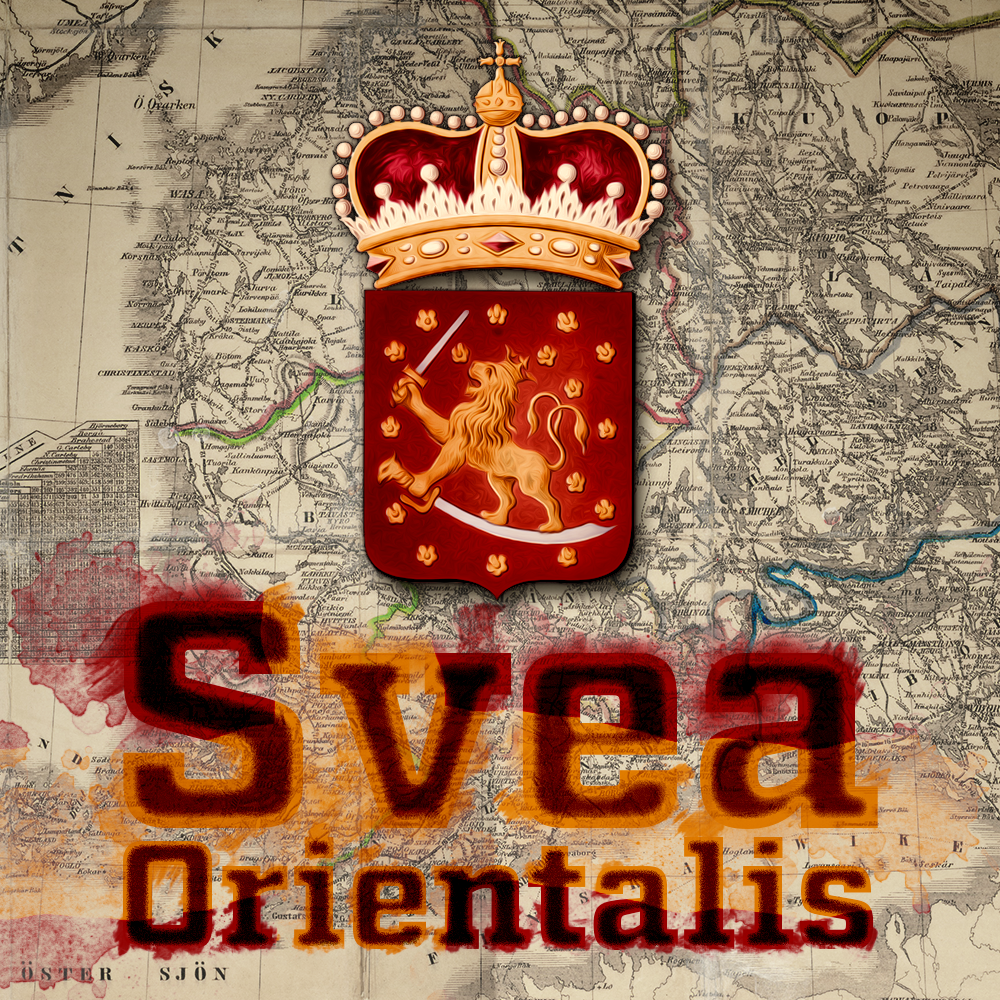

# Svea Orientalis

Svea Orientalis - A Victoria 3 Mod

## Svea Orientalis - Eastern Sweden

The year is 1836. After the catastrofic peace terms of the Finnish War of 1808-09, the Swedish Crown was forced to part with its eastern part. Much to the Tsar's delight, a forested peninsula dotted with thousands of seas was transferred under his control.

While agreements made by Northern Europe's foremost powers were drafted, nobody bothered to ask the people living in these lands. While not always treated in the most delicate fashion by the Swedish monarchs, there were a significant portion of the population still longing for the Swedish time. The Svecoman movement was a pro-Swedish nationalist movement based upon Finland's long history of being a part of Sweden.

The Svecoman movement mainly rose as a reaction to the Fennoman movement. The Fennoman nationalist movement's main point was the legacy use of Swedish as the administrative language while those speaking Swedish only represented 15 percent of the population.

## Features
- New Finnish states in accordance with the [provinces of 1831-1921](https://en.wikipedia.org/wiki/Provinces_of_Finland#Geographical_evolution_of_provincial_administration) (excl. Åland which is kept separately because of playability reasons).

## Work In Progress
- A Journal Entry system for [Finland's Language Strife](https://en.wikipedia.org/wiki/Finland%27s_language_strife)
- Ideologies based on the Fennoman and Svecoman movements which influence the Language Strife.
- A Journal Entry system for the [Russification of Finland](https://en.wikipedia.org/wiki/Russification_of_Finland) and the reactionary movements against it

## To Do
- Add Sweden's and Russia's respective journal entries along with interacting events to make Finland's journal entry less 'isolated'.
- Add more flavour events independent of the journal entries to Fennoscandia, reflecting the various historic occurances.
- Add journal entries for "after the fact" of either Finnish independence or for Sweden post-reunion.